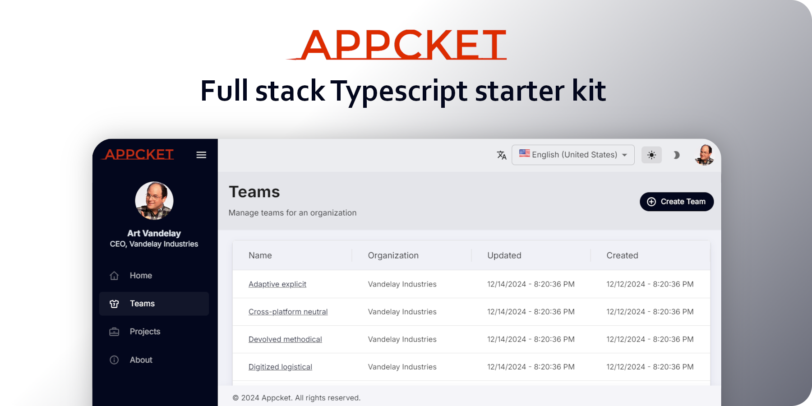

# Appcket

Appcket is a Typescript starter-kit/boilerplate that allows developers to quickly stand up a full-featured web application.

Out of the box, you get all of this:

1. Local Kubernetes development environment
1. Local https certs setup for you
1. Postgres database
1. Keycloak instance with user authentication and authorization
1. GraphQL api powered by NestJS and protected by Keycloak's authn/authz
1. Frontend app powered by React and protected by Keycloak's authn/authz
1. Marketing site powered by Astro

See the [Appcket docs](https://appcket.org) for more information and to get started.