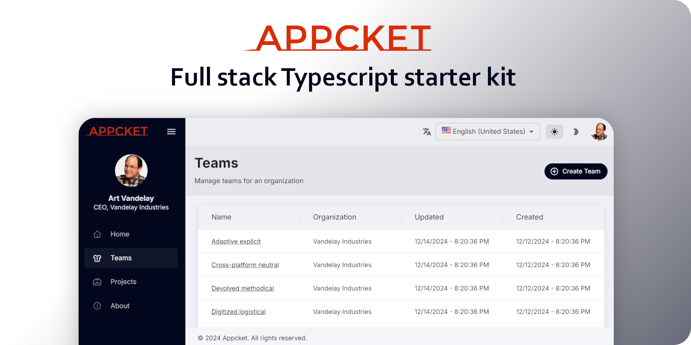

# Appcket

Appcket is an open source "system design starter kit". It is a reference architecture/application that allows developers to quickly stand up full-featured, event driven apps.

Out of the box, you get all of this:

1. Local Kubernetes development environment
1. Local https certs
1. Postgres database
1. ClickHouse data warehouse
1. Redpanda streaming platform
1. Keycloak instance with user authentication and authorization
1. GraphQL api powered by NestJS and protected by Keycloak's authn/authz
1. Frontend app powered by React, with full i18n support and protected by Keycloak's authn/authz
1. Marketing site powered by Astro

See the [Appcket docs](https://appcket.org) for more information and to get started.